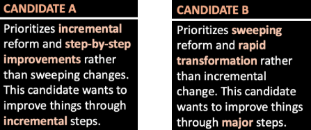

```{r,include=FALSE}
detachAllPackages <- function() {

  basic.packages <- c("package:stats","package:graphics","package:grDevices","package:utils","package:datasets","package:methods","package:base")

  package.list <- search()[ifelse(unlist(gregexpr("package:",search()))==1,TRUE,FALSE)]

  package.list <- setdiff(package.list,basic.packages)

  if (length(package.list)>0)  for (package in package.list) detach(package, character.only=TRUE)

}

detachAllPackages()
```

```{r setup, include=FALSE}
library(apa)
library(see)
library(lme4)
library(lmerTest)
library(interactions)
library(jtools)
library(gridExtra)
library(kableExtra)
library(apaTables)
library(papaja)
library(rstatix)
library(knitr)
library(psych)
library(GPArotation)
library(PerformanceAnalytics)
library(gt)
library(tidytext)
library(textdata)
library(tidyverse)
library(diagram)
library(factoextra)
library(SnowballC)
library(hunspell)
library(quanteda)
library(bruceR)
library(here)

repo_url <- "https://raw.githubusercontent.com/deanbaltiansky/left-behind/main/study-dec25/data/"

df_lebe <- readr::read_csv(paste0(repo_url,"df_lebe.csv"), show_col_types = FALSE)
```

```{r,include=FALSE}
df_lebe <- df_lebe %>% 
  mutate(income = factor(income,c("$0-$20,000",
                                  "$20,001-$40,000",
                                  "$40,001-$60,000",
                                  "$60,001-$80,000",
                                  "$80,001-$100,000",
                                  "$100,001-$120,000",
                                  "$120,001-$140,000",
                                  "$140,001-$160,000",
                                  "$160,001-$180,000",
                                  "$180,001-$200,000",
                                  "Over $200,000")),
         edu = factor(edu,c("noHS",
                            "GED",
                            "2yearColl",
                            "4yearColl",
                            "MA",
                            "PHD")))

df_lebe_elg <- df_lebe %>% 
  filter(is_elg == 1 & party_forgroup != "True Independent")
```

# Background

This is a pilot study that starts to unpack the interaction of partisanship and feeling left behind as they predict support for sweeping change candidates.

Participants first completed a demographic and political identification questionnaire.

Then, they indicated the extent to which they feel left behind.

Then, they were randomly assigned to one of two conditions: *inparty* or *outparty*.

All participants were told to imagine a gubernatorial race in which there are two Democratic/Republican candidates. Democrats in the *inparty* condition were told that they're both Democrats; Democrats in the *outparty* condition were told that they're both Republicans; Republicans in the *inparty* condition were told that they're both Republicans; Republicans in the *outparty* condition were told that they're both Democrats.

In all elections, Candidate A prioritized incremental change, whereas Candidate B prioritized sweeping change.

Participants were asked who they would prefer.

# Eligibility

For the purpose of this study, we'll exclude those who failed the bot detection check, as well as True Independents (they don't have an outparty).

```{r,results='asis',echo=TRUE,warning=FALSE,message=F}
eligible_n <- df_lebe %>% 
  filter(is_elg == 1 & party_forgroup != "True Independent") %>% 
  nrow()

df_lebe %>% 
  group_by(att_2,party_forgroup) %>% 
  summarise(N = n()) %>% 
  ungroup() %>% 
  kbl() %>% 
  kable_styling(bootstrap_options = "hover",
                full_width = F,
                position = "left")
```

That gives us a total of `r eligible_n` eligible participants

# Demographics

## Race

```{r,results='asis',echo=TRUE,warning=FALSE}
df_lebe_elg %>% 
  group_by(race) %>% 
  summarise(N = n()) %>% 
  ungroup() %>% 
  mutate(Perc = round(100*(N/sum(N)),2)) %>% 
  ungroup() %>% 
  arrange(desc(N)) %>% 
  kbl() %>% 
  kable_styling(bootstrap_options = "hover",
                full_width = F,
                position = "left")
```

## Gender

```{r,echo=TRUE,results='asis',warning=FALSE}
df_lebe_elg %>% 
  mutate(gender = ifelse(is.na(gender) | gender == "","other",gender)) %>% 
  group_by(gender) %>% 
  summarise(N = n()) %>% 
  ungroup() %>% 
  mutate(Perc = round(100*(N/sum(N)),2)) %>% 
  ungroup() %>% 
  arrange(desc(N)) %>% 
  kbl() %>% 
  kable_styling(bootstrap_options = "hover",
                full_width = F,
                position = "left")
```

## Age

```{r,echo=TRUE,results='asis',warning=FALSE}
df_lebe_elg %>% 
  summarise(age_mean = round(mean(age,na.rm = T),2),
            age_sd = round(sd(age,na.rm = T),2)) %>% 
  kbl() %>% 
  kable_styling(bootstrap_options = "hover",
                full_width = F,
                position = "left")
```

## Education

```{r,echo=TRUE,results='asis',warning=FALSE}
df_lebe_elg %>% 
  group_by(edu) %>% 
  summarise(N = n()) %>% 
  ungroup() %>% 
  mutate(Perc = round(100*(N/sum(N)),2)) %>% 
  ungroup() %>% 
  kbl() %>% 
  kable_styling(bootstrap_options = "hover",
                full_width = F,
                position = "left")
```


## Income

```{r,fig.align='left',echo=TRUE,warning=FALSE,fig.dim=c(5,3)}
df_lebe_elg %>% 
  ggplot(aes(x = income)) +
  geom_bar() +
  theme(panel.grid.major = element_blank(),
        panel.grid.minor = element_blank(),
        panel.background = element_blank(),
        axis.ticks = element_blank(),
        axis.line = element_line(color = "grey66"),
        axis.text.y = element_text(color = "black"),
        axis.text.x = element_text(color = "black",
                                   face = "bold"),
        axis.title.x = element_blank(),
        axis.title.y = element_blank()) +
  coord_flip()
```

# Politics

## Ideology

Please indicate your general political ideology (1 = *Extremely Liberal* to 7 = *Extremely Consevative*)

```{r,fig.align='left',echo=TRUE,warning=FALSE,fig.dim=c(7,5)}
df_lebe_elg %>%
  ggplot() +
  geom_histogram(aes(x = ideo), fill = "lightblue",color= NA,
                 binwidth = 1) +
  scale_x_continuous(limits = c(0,8),
                     breaks = seq(1,7,1)) +
  geom_vline(xintercept = mean(df_lebe_elg$ideo,na.rm = T),
             color = "black",
             linetype = "dashed",
             size = 1.1) +
  theme(panel.grid.major = element_blank(),
        panel.grid.minor = element_blank(),
        panel.background = element_blank(),
        axis.ticks = element_blank(),
        axis.line = element_line(color = "grey66"),
        axis.text.y = element_text(color = "black"),
        axis.text.x = element_text(color = "black",
                                   face = "bold"))

```

## Party ID

### Initial selection

```{r,echo=TRUE,results='asis',warning=FALSE}
df_lebe_elg %>% 
  group_by(party_gen) %>% 
  summarise(N = n()) %>% 
  ungroup() %>% 
  mutate(Perc = round(100*(N/sum(N)),2)) %>% 
  ungroup() %>% 
  arrange(desc(N)) %>% 
  kbl() %>% 
  kable_styling(bootstrap_options = "hover",
                full_width = F,
                position = "left")
```

### With followups

```{r,echo=TRUE,results='asis',warning=FALSE}
df_lebe_elg %>% 
  group_by(party_followup) %>% 
  summarise(N = n()) %>% 
  ungroup() %>% 
  mutate(Perc = round(100*(N/sum(N)),2)) %>% 
  ungroup() %>% 
  kbl() %>% 
  kable_styling(bootstrap_options = "hover",
                full_width = F,
                position = "left")
```

# Measures

## Left behind: Continuous

People in America come from all walks of life. Some feel left behind while others are advancing. We are interested in how you feel and what that means for you.\
\
**To what extent do you feel left behind?** (0 = *Not at All Left Behind* to 100 = *Extremely Left Behind*)

```{r,fig.align='left',echo=TRUE,warning=FALSE,fig.dim=c(4,3)}
df_lebe_elg %>% 
  ggplot(aes(x = lebe_cont)) +
  geom_histogram(fill = "lightblue",
                 binwidth = 5) +
  scale_x_continuous(breaks = seq(0,100,20),
                     limits = c(-10,110)) +
  ylab("count") +
  geom_vline(xintercept = mean(df_lebe_elg$lebe_cont,na.rm = T),
             color = "black",
             linetype = "dashed",
             size = 1.1) +
  theme(panel.grid.major = element_blank(),
        panel.grid.minor = element_blank(),
        panel.background = element_blank(),
        axis.ticks = element_blank(),
        axis.line = element_line(color = "grey66"),
        axis.text.y = element_text(color = "black"),
        axis.text.x = element_text(color = "black",
                                   face = "bold"),
        axis.title.x = element_text(color = "black",
                                   face = "bold"))
```

## Election

Which of the following two **[Democratic/Republican]** candidates for governor do you prefer?



```{r,echo=TRUE,results='asis',warning=FALSE}
df_lebe_elg %>% 
  group_by(choice) %>% 
  summarise(N = n()) %>% 
  ungroup() %>% 
  mutate(Perc = round(100*(N/sum(N)),2)) %>% 
  ungroup() %>% 
  kbl() %>% 
  kable_styling(bootstrap_options = "hover",
                full_width = F,
                position = "left")
```

# Analysis

## Left behind -> Support for candidate

First, let's see if we can replicate the main effect of feeling left behind on support for sweeping candidate.

Below, Candidate B was coded as 1 and Candidate A was coded as 0.

```{r,results='asis',echo=TRUE,warning=FALSE,message=FALSE}
m1 <- lm(choice_sweep ~ lebe_cont,data = df_lebe_elg)

eta_table <- eta_squared(m1)
etas_for_table <- c(NA,eta_table$Eta2)
apa_lm <- apa_print(m1)
table_for_print <- apa_lm$table %>% 
  mutate(eta2 = round(etas_for_table,3))
 
kbl(table_for_print) %>% 
  kable_styling(bootstrap_options = "hover",
                full_width = F,
                position = "left")
```

Oh, there's no main effect. Ok. Let's see if there's an interaction with condition.

## Interaction -> Support for candidate

```{r,results='asis',echo=TRUE,warning=FALSE,message=FALSE}
m1 <- lm(choice_sweep ~ lebe_cont*cond,data = df_lebe_elg)

eta_table <- eta_squared(m1)
etas_for_table <- c(NA,eta_table$Eta2)
apa_lm <- apa_print(m1)
table_for_print <- apa_lm$table %>% 
  mutate(eta2 = round(etas_for_table,3))
 
kbl(table_for_print) %>% 
  kable_styling(bootstrap_options = "hover",
                full_width = F,
                position = "left")
```

Hmm, there's no interaction either. Ok.

## Main effect of condition

We should see some strong effects here for inparty. Presumably, people would prefer sweeping change candidates from their own party, as opposed to their outparty.

```{r,echo=TRUE,results='asis',warning=FALSE}
df_lebe_elg %>% 
  group_by(cond) %>% 
  summarise(sweep_M = mean(choice_sweep,na.rm = T),
            sweep_SD = sd(choice_sweep,na.rm = T)) %>% 
  ungroup() %>% 
  kbl() %>% 
  kable_styling(bootstrap_options = "hover",
                full_width = F,
                position = "left")
```

## Party effect with condition

```{r,echo=TRUE,results='asis',warning=FALSE}
df_lebe_elg %>% 
  group_by(party_forgroup,cond) %>% 
  summarise(sweep_M = mean(choice_sweep,na.rm = T),
            sweep_SD = sd(choice_sweep,na.rm = T)) %>% 
  ungroup() %>% 
  kbl() %>% 
  kable_styling(bootstrap_options = "hover",
                full_width = F,
                position = "left")
```

Stronger inparty effect for democrats. ok.

## who is more left behind?

```{r,echo=TRUE,results='asis',warning=FALSE}
df_lebe_elg %>% 
  group_by(party_forgroup) %>% 
  summarise(leftbehind_M = mean(lebe_cont,na.rm = T),
            leftbehind_SD = sd(lebe_cont,na.rm = T)) %>% 
  ungroup() %>% 
  kbl() %>% 
  kable_styling(bootstrap_options = "hover",
                full_width = F,
                position = "left")
```

Democrats feel way more left behind. We know from our previous studies that left behind and ideology is correlated, so it's not new, but still, that finding itself would probably surprise a lot of people. Let's see if the effect of left behind on support for candidate is stronger for democrats (in the inparty condition)

```{r,fig.align='left',echo=TRUE,warning=FALSE,fig.dim=c(6,6)}
df_lebe_elg %>% 
  ggplot(aes(x = lebe_cont,y = choice_sweep,color = party_forgroup)) +
  scale_color_manual(values = c("darkblue",
                                "darkred")) +
  geom_smooth(method = "lm") +
  theme(panel.grid.major = element_blank(),
        panel.grid.minor = element_blank(),
        panel.background = element_blank(),
        axis.ticks = element_blank(),
        axis.line = element_line(color = "grey66"),
        axis.text.y = element_text(color = "black"),
        axis.text.x = element_text(color = "black",
                                   face = "bold"),
        axis.title.x = element_text(color = "black",
                                   face = "bold")) +
  facet_wrap(~cond,nrow = 2)
```

Oh, that's a little confusing. It looks like the effect of feeling left behind on support for sweeping change candidates is stronger for Democrats in the outparty condition than in the inparty condition. And for Republicans it's the opposite outparty effect. Basically, Democrats who feel left behind prefer a sweeping change Republican over an incremental Republican. Republicans who feel left behind prefer an incremental Democrat over a sweeping change Democrat. For the inparty, which is where we'd expect the effect, we're not seeing a very strong effect at all.